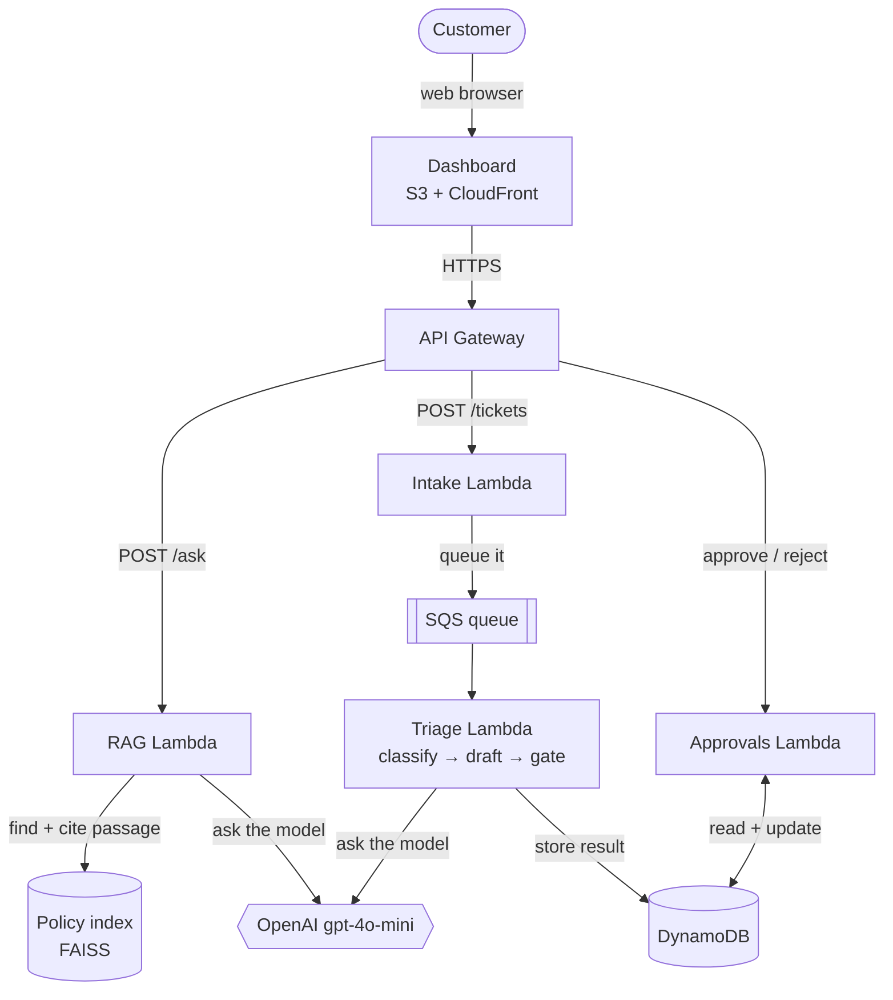

# TicketPilot


**An AI support system that reads incoming customer tickets, sorts them, drafts replies, and asks a human to approve only the risky ones — plus a chatbot that answers policy questions with citations.** Built as two small AI "agents" running on serverless AWS.

> In plain terms: it does the boring 80% of a support inbox automatically, and taps a human on the shoulder for the sensitive 20%.

---

## 🚀 Try it live

**Dashboard: [https://d2m9tsplwhuev5.cloudfront.net](https://d2m9tsplwhuev5.cloudfront.net)**

Three things to try:
1. **Ask a policy question** — e.g. *"What is the refund window?"* → get an answer **with the exact policy source cited** (and it says "I don't know" if the answer isn't in the docs, instead of making something up).
2. **Submit a ticket** — e.g. *"I was double-charged and I'm locked out"* → it gets classified and queued in the background.
3. **Work the approval queue** — the ticket you submitted shows up (if the AI flagged it), with a draft reply. Click **Approve** or **Reject**.

*(The demo is on AWS free tier and may be turned off to save cost — if the link is down, see [Run it yourself](#run-it-yourself). It redeploys with one command.)*

---

## What it does

TicketPilot is **two independent AI agents**:

| Agent | What it's for | How it behaves |
|-------|--------------|----------------|
| 🎫 **Triage agent** | Handle incoming support tickets | Reads a ticket → labels it (**category, urgency, sentiment**) → **drafts a reply** → decides: safe to auto-send, or **escalate to a human**. |
| 📚 **Policy Q&A agent (RAG)** | Answer questions about company policy | Finds the relevant policy passage → answers **only** from that text → **cites the source** → refuses if the answer isn't in the docs. |

The key idea is **human-in-the-loop**: the AI does the volume, but anything low-confidence or sensitive (billing, fraud, "I'll call my lawyer"…) is held for a human to approve. Humans never see the easy stuff.

---

## How it works



**The flow, step by step:**
1. A customer submits a ticket on the dashboard → it hits **API Gateway** → a small **Intake** function drops it on an **SQS queue** (so bursts don't overwhelm anything).
2. The **Triage** function picks it up, uses **LangGraph** to run *classify → draft reply*, then an **escalation gate** decides auto-send vs. human review. The result is saved in **DynamoDB**.
3. A human opens the **approval queue**, reads the AI's draft, and clicks approve/reject — recorded back to DynamoDB.
4. Separately, the **RAG** function answers policy questions by retrieving the most relevant policy chunk and forcing the model to answer *only* from it, with a citation.

Everything is **serverless** — nothing runs until a request comes in, so it costs ~$0 when idle.

---

## Results (measured)

Real before→after numbers from the eval harness (`evals/`), improved by prompt iteration:

| What's measured | Result |
|---|---|
| Ticket urgency accuracy | **80%** (up from 68%) |
| Ticket category accuracy | **90%** |
| Answer quality (LLM-judged, 1–5) | **4.9 / 5** |
| **Citation accuracy** (answer points to the right policy) | **100%** (up from 31%) |
| Refusal accuracy (correctly says "not in the docs") | **100%** |
| Repeat-question latency (with caching) | **2846 ms → 0.2 ms** |

---

## Tech stack

- **Agents / LLM:** Python, [LangGraph](https://langchain-ai.github.io/langgraph/), OpenAI `gpt-4o-mini` + `text-embedding-3-small`
- **RAG:** FAISS vector search, chunk-and-cite grounding with a refusal guarantee
- **Validation:** Pydantic (the LLM must return valid, schema-checked JSON; invalid output is auto-retried)
- **AWS (serverless):** Lambda (×4, one shared **arm64 container image**), API Gateway, SQS (+ dead-letter queue), DynamoDB, S3 + CloudFront, SSM, CloudWatch
- **Infra as code:** AWS SAM (`infra/template.yaml`), one-command deploy
- **Quality:** eval harness + LLM-as-judge, semantic response caching, structured JSON logging, pytest + GitHub Actions CI

---

## Run it yourself

**Locally (no AWS needed):**
```bash
python -m venv .venv && source .venv/bin/activate
pip install -r requirements.txt
cp .env.example .env         # add your OpenAI API key

python -m src.rag_agent.ingest        # build the policy index
python scripts/cache_demo.py          # see the RAG agent + caching in action
python -m pytest                      # run the tests
python evals/run_eval.py --label demo # score both agents
```

**Deploy to AWS (needs an AWS account + Docker):**
```bash
# one-time: put your OpenAI key in SSM
aws ssm put-parameter --name /ticketpilot/openai-api-key --type String --value "sk-..." --overwrite

bash infra/deploy.sh          # builds the image, pushes to ECR, creates the stack
# ...prints your API + dashboard URLs

aws cloudformation delete-stack --stack-name ticketpilot   # tear it all down
```

---

## Project structure

```
src/
  triage_agent/   classify → draft (LangGraph) + escalation gate + Lambda handler
  rag_agent/      ingest → retrieve → cited answer + Lambda handler
  shared/         config, LLM wrapper, Pydantic models, store, cache, logging
  api.py          intake + approvals HTTP handlers
infra/            SAM template, Dockerfile, deploy script
evals/            golden sets + scoring harness (accuracy + LLM-as-judge)
dashboard/        single-file web UI
tests/            pytest unit tests (run in CI)
docs/             project brief + ops runbook
```

---

## Engineering notes

- **Grounding guarantee:** the RAG agent refuses when the best-matching policy chunk scores below a threshold — it would rather say "I don't have that" than hallucinate.
- **Escalation gate:** a ticket is sent to a human if confidence is low **or** the category/keywords are sensitive (billing, fraud, legal threats). Tuned to never *under*-escalate risky tickets.
- **Caching:** identical questions return from cache instantly; reworded questions hit a **semantic cache** (cosine similarity), skipping the model entirely.
- **Observability:** every action emits a structured JSON log to CloudWatch; alarms fire on triage errors or dead-letter messages (see `docs/runbook.txt`).
- **Cost-aware:** on-demand DynamoDB, arm64/Graviton Lambdas, no idle cost, budget alarms.

## License

MIT — see [LICENSE](LICENSE).
